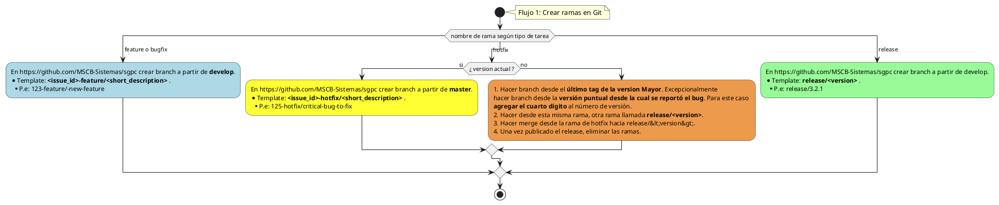
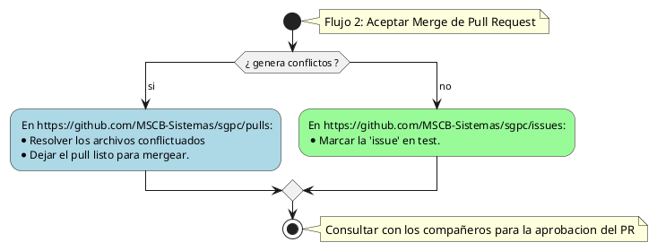

Git

- [Git](#git)
- [Nombrado de ramas](#nombrado-de-ramas)
- [Definición de changelogs](#definición-de-changelogs)
- [Gestión de commits](#gestión-de-commits)
    - [Configuración de git](#configuración-de-git)
- [Titulación de Pull Requests (PR)](#titulación-de-pull-requests-pr)
- [Flujos](#flujos)
    - [Flujo 1: Crear ramas en Git](#flujo-1-crear-ramas-en-git)
    - [Flujo 2: Aceptar Pull Request en Git](#flujo-2-aceptar-pull-request-en-git)
    - [Flujo de trabajo en la detección de BUGs](#flujo-de-trabajo-en-la-detección-de-bugs)
- [Links](#links)

## Git

Nos acoplamos al flujo propuesto por ‘atlassian’ (adaptada a nosotros):
 https://www.atlassian.com/es/git/tutorials/comparing-workflows/gitflow-workflow

## Nombrado de ramas

- Las ramas ‘main’, y ‘submain’:
    - Son las unicas permanentes.
    - Deben estar protegidas.
- Las ramas se nombrarán:
    - Feature branches: **&lt;id-issue&gt;-feature/&lt;short-description&gt;**
    - Release branches: **release/&lt;version&gt;**
    - Test branches: **&lt;id-issue&gt;-test/&lt;short-description&gt;**
    - Documentation branches: **&lt;id-issue&gt;-doc/&lt;short-description&gt;**
    - Hotfix branches: **&lt;id-issue&gt;-hotfix/&lt;short-description&gt;**
    - Bugfix branches: **&lt;id-issue&gt;-bugfix/&lt;short-description&gt;**
- **IMPORTANTE:** El ID de issue tiene que ser estrictamente igual al del issue presente en la seccion 'issues' del repositorio.
- Si hubiese que realizar cambios en una version anterior (solo Hotfixes):

1.  Hacer branch desde el último tag de la version Mayor. Excepcionalmente hacer branch desde la versión puntual desde la cual se reportó el bug. Para este caso agregar el cuarto dígito.
2.  Hacer desde esta misma rama, otra rama llamada release/&lt;version&gt;.
3.  Hacer merge desde la rama de hotfix hacia release/&lt;version&gt;.
4.  Una vez publicado el release, eliminar las ramas.

## Definición de changelogs

Cada repositorio contara con un changelog en el README donde se indicaran los cambios realizados issue a issue, cada linea debera ser nomenclada con el tipo de issue (bugfix, hotfix, feature, test) seguido de una barra y el numero de issue seguida de la descripción del cambio, EJEMPLO: `feature/#5: Se implementa funcionalidad Y`

Durante el desarrollo, cuando no hay una version definida se colocara como titulo "NEXT_VERSION" y debajo las anotaciones.

Por ejemplo

- NEXT_VERSION
    - `feature/#2`: se implementa funcionaldad Y
    - `feature/#1: Se implementa funcionalidad X`
- 1.2.0
    - `bugfix/#4: se corrige error de codificacion`

## Gestión de commits

Cada commit debe iniciar con un numeral, seguido del numero de issue y una breve descripción del trabajo realizado.

Por ejemplo: “#1: Renombrando clase principal”

## Titulación de Pull Requests (PR)

El título del PR debe tener el siguiente formato:

```plaintext
<emoji> <repo-name> - <issue-number>/<issue-type> - <short-description>
```

**Por ejemplo:**

⭐ NormativeLib - <span dir="">#</span>1/feature - Soporte para strings

🪲 NormativeLib - <span dir="">#</span>2/bugfix - Handling división por cero

🚀 NormativeLib - <span dir="">#</span>3/release - Version 1.0.1

🔥 NormativeLib - <span dir="">#</span>4/hotfix - Version 1.0.2 - se arregla interfaz

🧪 NormativeLib - <span dir="">#</span>5/test - Test unitario de clase Expression

📝 NormativeLib - <span dir="">#</span>6/doc - Diagramas de diseño

## Flujos

#### **Flujo 1: Crear ramas en Git**



#### **Flujo 2: Aceptar Pull Request en Git**



### Flujo de trabajo en la detección de BUGs

COMPLETAR

## Links

COMPLETAR 